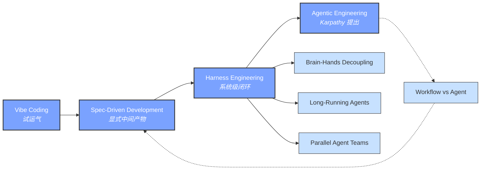
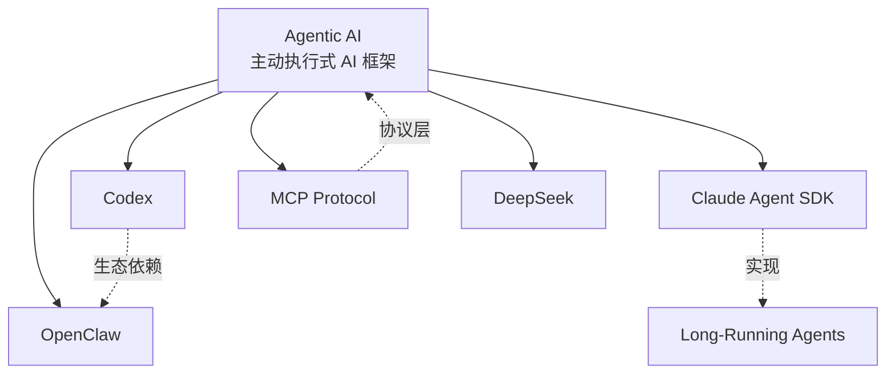
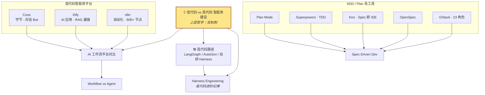
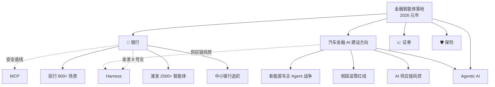
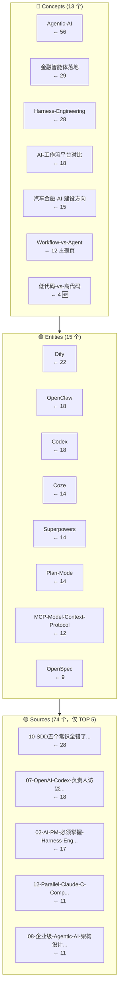
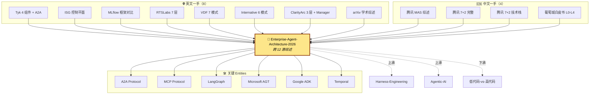

# 📊 Wiki 知识图谱

> 更新于 2026-06-29 第 6 轮 ingest 后
> 节点 **120**（含 12 新 source + 5 新 entity + 1 新 concept）| 中心节点入度 TOP：Agentic-AI / Enterprise-Agent-Architecture-2026（新增）/ 金融智能体落地 / Harness-Engineering
>
> ⚠️ Lint 待办：上次发现的 44 个孤儿 source + 60+ 失效引用仍未修，详见 [[lint-2026-06-29]]

---

## 🧭 阅读建议

- **图 1 主线四概念演进** — 从 Vibe Coding 到 Agentic Engineering 的范式跃迁
- **图 2 概念-实体生态** — 核心 concept 与工具的连接
- **图 3 低代码平台横评** — Coze/Dify/n8n 及关系
- **图 4 金融 vertical 子图** — 汽车金融 + 银行 + 行业概念
- **图 5 全 Wiki 鸟瞰** — 按类型分层
- **Obsidian Graph View 配套** — Cmd+G + Filters/Groups 见末尾

---

## 图 1 · 主线四概念演进

---

## 图 2 · Agentic-AI 概念-实体生态

---

## 图 3 · 低代码 / 高代码 平台横评

> 🆕 2026-06-29 新增上层节点 [[concepts/低代码-vs-高代码-智能体建设]]，统领低代码（Coze/Dify/n8n）与高代码（Harness/LangGraph）两条路径。

---

## 图 4 · 金融 vertical 子图

---

## 图 5 · 全 Wiki 鸟瞰

---

## 🏆 入度 TOP 15（2026-06-29 重算）

| 排名 | 类型 | 节点 | 入度 | 变化 |
|---|---|---|---|---|
| 1 | concepts | Agentic-AI | 56 | ↓ (65→56，去重后) |
| 2 | concepts | 金融智能体落地 | 29 | ↑ |
| 3 | sources | 10-SDD五个常识全错了 | 28 | = |
| 4 | concepts | Harness-Engineering | 28 | ↓ |
| 5 | sources | 02-AI-PM-必须掌握-Harness-Engineering | 19 | ↑ |
| 6 | sources | 07-OpenAI-Codex-负责人访谈 | 18 | = |
| 7 | entities | Dify | 18 | ↓ |
| 8 | concepts | AI-工作流平台对比 | 18 | ↑ (←本轮 +1 来自新概念) |
| 9 | concepts | 汽车金融-AI-建设方向 | 15 | ↓ |
| 10 | entities | OpenClaw | 13 | ↓ |
| 11 | sources | 01-n8n-vs-Dify-vs-Coze | 13 | ↑ |
| 12 | sources | 13-Harness-Design-Long-Running-Apps | 12 | = |
| 13 | entities | MCP-Model-Context-Protocol | 12 | = |
| 14 | concepts | Workflow-vs-Agent | 12 | ⚠️ 缺失页（被 12 处引用但文件不存在）|
| 15 | sources | 12-Parallel-Claude-C-Compiler | 11 | = |

🆕 **新增节点**：[[concepts/低代码-vs-高代码-智能体建设]] 入度 4 / 出度 29（含 18 sources + 6 concepts + 5 entities）

🆕 **2026-06-29 第 6 轮新增**：
- **[[concepts/Enterprise-Agent-Architecture-2026]]** —— 跨 12 篇 source 的核心综述页，**预计入度成为 Top 5 内**（被 12 个 sources 反向引用 + 5 个 entities）
- **新 sources（68-79）**：12 个企业级架构 source（Tyk / ISG / MLflow / RTSLabs / VDF / Internative / ClarityArc / arXiv / 腾讯 ×3 / 葡萄城）
- **新 entities（5 个）**：[[entities/A2A-Protocol]] / [[entities/LangGraph]] / [[entities/Microsoft-AGT]] / [[entities/Google-ADK]] / [[entities/Temporal]]

## 🆕 图 6 · 企业级 Agent 架构 2026 综述子图

---

## 🎨 Obsidian Graph View 配套设置

打开 `Cmd+G` 后建议这样设置：

### 1. Filters
- Files: `path:Clippings/wiki`（只看 wiki 层，过滤原始素材）
- 或 `path:Clippings/wiki/sources` 只看 source 子图

### 2. Groups（按类型上色）
| Query | 颜色 |
|---|---|
| `path:Clippings/wiki/concepts` | 🔵 蓝 |
| `path:Clippings/wiki/entities` | 🟢 绿 |
| `path:Clippings/wiki/sources` | 🟡 黄 |
| `path:Clippings/wiki/graph` | 🔴 红（主图谱本身）|

### 3. Display
- Show arrows: ✅
- Node size: 按入度（默认）
- Repel force: 调高让聚类更明显

---

## 🔄 如何重新生成

当 wiki 内容更新后，跑：

- 告诉 AI："**重新生成 wiki 知识图谱**"

AI 会自动扫所有 wiki 文件 → 重算入度/出度 → 重写 graph.md。
