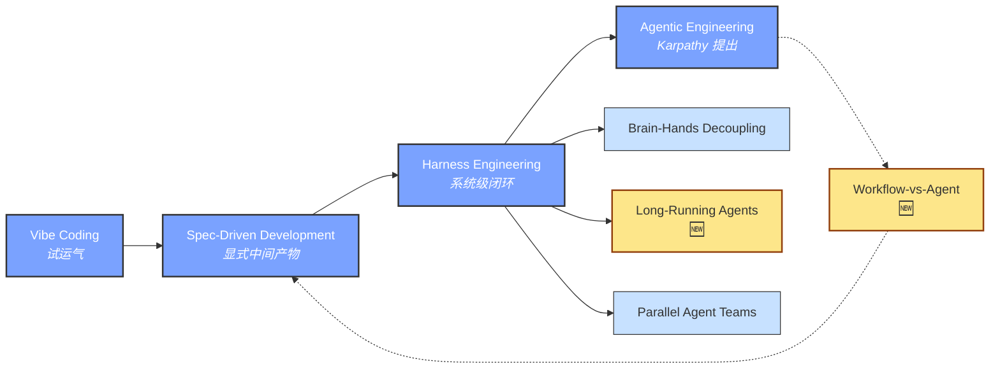
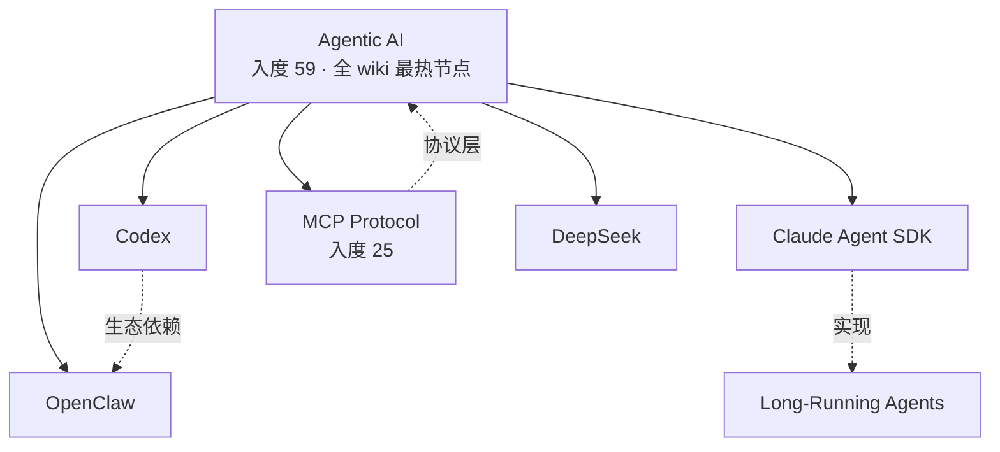
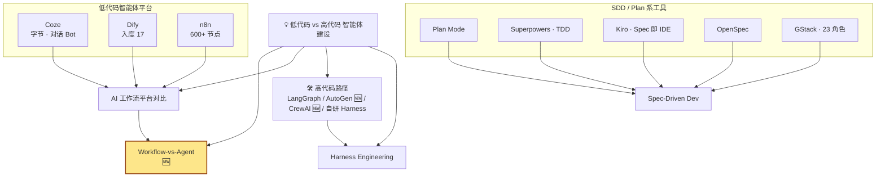
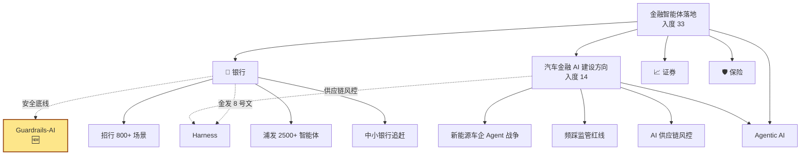
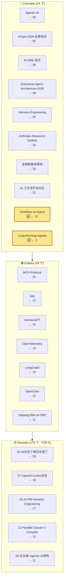

# 📊 Wiki 知识图谱

> **更新于 2026-07-13 · P0 修复轮**（07-11 lint 后二次深度修复）
> **节点 244**（24 concept + 45 entity + 175 source）· 中心节点入度 TOP：Agentic-AI / AIOps-2026-全景综述 / AI-SRE-范式 / Enterprise-Agent-Architecture-2026
>
> ✅ 相较 06-29 版：**91 → 0 断链**、44 孤儿 → 17 孤儿、20 concept → 24 concept、28 entity → 45 entity、132 source → 175 source
>
> 变更详见 [[log|📝 log · 2026-07-13 lint 记录]]

---

## 🧭 阅读建议

- **图 1 主线四概念演进** —— 从 Vibe Coding 到 Agentic Engineering 的范式跃迁
- **图 2 概念-实体生态** —— 核心 concept 与工具的连接
- **图 3 低代码平台横评** —— Coze/Dify/n8n 及关系
- **图 4 金融 vertical 子图** —— 汽车金融 + 银行 + 行业概念
- **图 5 全 Wiki 鸟瞰** —— 按类型分层（数据更新至 2026-07-13）
- **图 6 企业级 Agent 架构综述子图** —— 12 一手源 → 综述 → 6 关键 entity
- **Obsidian Graph View 配套** —— Cmd+G + Filters/Groups 见末尾

---

## 图 1 · 主线四概念演进

```mermaid
flowchart LR
    Vibe[Vibe Coding<br/><i>试运气</i>] --> SDD[Spec-Driven Development<br/><i>显式中间产物</i>]
    SDD --> Harness[Harness Engineering<br/><i>系统级闭环</i>]
    Harness --> AgEng[Agentic Engineering<br/><i>Karpathy 提出</i>]
    Harness --> BHD[Brain-Hands Decoupling]
    Harness --> LRA[Long-Running Agents<br/>🆕]
    Harness --> PAT[Parallel Agent Teams]
    AgEng -.-> WvA[Workflow-vs-Agent<br/>🆕]
    WvA -.-> SDD
    classDef main fill:#7aa2ff,color:#fff,stroke:#333,stroke-width:2px
    classDef sub fill:#c7e1ff,stroke:#333
    classDef new fill:#fde68a,stroke:#92400e,stroke-width:2px
    class Vibe,SDD,Harness,AgEng main
    class BHD,PAT sub
    class LRA,WvA new
```

> 🆕 **2026-07-13 P0 修复轮新增**：[[concepts/Long-Running-Agents]] · [[concepts/Workflow-vs-Agent]]（消除 15 处历史断链）

---

## 图 2 · Agentic-AI 概念-实体生态

```mermaid
flowchart TB
    AI[Agentic AI<br/>入度 59 · 全 wiki 最热节点]
    AI --> Codex
    AI --> ClaudeSDK[Claude Agent SDK]
    AI --> OpenClaw
    AI --> MCP[MCP Protocol<br/>入度 25]
    AI --> DeepSeek
    Codex -.->|生态依赖| OpenClaw
    ClaudeSDK -.->|实现| LRA[Long-Running Agents]
    MCP -.->|协议层| AI
```

---

## 图 3 · 低代码 / 高代码 平台横评

```mermaid
flowchart TB
    Top["💡 低代码 vs 高代码 智能体建设"]
    Top --> WvA[Workflow-vs-Agent<br/>🆕]
    Top --> 对比[AI 工作流平台对比]
    Top --> HighCode["🛠 高代码路径<br/>LangGraph / AutoGen 🆕 / CrewAI 🆕 / 自研 Harness"]
    Top --> Harness[Harness Engineering]

    subgraph LC["低代码智能体平台"]
        Coze[Coze<br/>字节 · 对话 Bot]
        Dify[Dify<br/>入度 17]
        n8n[n8n<br/>600+ 节点]
    end
    subgraph SDD_TOOLS["SDD / Plan 系工具"]
        Plan[Plan Mode]
        Super[Superpowers · TDD]
        Kiro[Kiro · Spec 即 IDE]
        OpenSpec
        GStack[GStack · 23 角色]
    end

    Coze --> 对比
    Dify --> 对比
    n8n --> 对比
    Plan --> SDD[Spec-Driven Dev]
    Super --> SDD
    OpenSpec --> SDD
    Kiro --> SDD
    GStack --> SDD
    对比 --> WvA
    HighCode --> Harness

    classDef new fill:#fde68a,stroke:#92400e,stroke-width:2px
    class WvA new
```

---

## 图 4 · 金融 vertical 子图

```mermaid
flowchart TB
    Fin[金融智能体落地<br/>入度 33]
    AutoFin[汽车金融 AI 建设方向<br/>入度 14]
    Fin --> Bank[🏦 银行]
    Fin --> Sec[📈 证券]
    Fin --> Ins[🛡 保险]
    Fin --> AutoFin
    Bank -.->|金发 8 号文| Harness
    AutoFin -.->|供应链风控| Harness
    Bank -.->|安全底线| Guardrails[Guardrails-AI<br/>🆕]
    AutoFin --> 车企[新能源车企 Agent 战争]
    AutoFin --> 监管[频踩监管红线]
    AutoFin --> 风控[AI 供应链风控]
    Bank --> 招商[招行 800+ 场景]
    Bank --> 浦发[浦发 2500+ 智能体]
    Bank --> 中小[中小银行追赶]
    Fin --> AI[Agentic AI]
    AutoFin --> AI

    classDef new fill:#fde68a,stroke:#92400e,stroke-width:2px
    class Guardrails new
```

---

## 图 5 · 全 Wiki 鸟瞰（数据更新 2026-07-13）

```mermaid
flowchart TB
    subgraph C["🔵 Concepts (24 个)"]
        c1[Agentic-AI<br/>← 59]
        c2[AIOps-2026-全景综述<br/>← 55]
        c3[AI-SRE-范式<br/>← 38]
        c4[Enterprise-Agent-Architecture-2026<br/>← 38]
        c5[Harness-Engineering<br/>← 34]
        c6[Anthropic-Research-2026H1<br/>← 34]
        c7[金融智能体落地<br/>← 33]
        c8[AI-工作流平台对比<br/>← 22]
        c9[Workflow-vs-Agent<br/>🆕 ← 12]
        c10[Long-Running-Agents<br/>🆕 ← 3]
    end

    subgraph E["🟢 Entities (45 个)"]
        e1[MCP-Protocol<br/>← 25]
        e2[Dify<br/>← 17]
        e3[HolmesGPT<br/>← 15]
        e4[OpenTelemetry<br/>← 14]
        e5[LangGraph<br/>← 14]
        e6[OpenClaw<br/>← 12]
        e7[Datadog-Bits-AI-SRE<br/>← 11]
    end

    subgraph S["🟡 Sources (175 个 · TOP 5)"]
        s1[10-SDD五个常识全错了<br/>← 28]
        s2[07-OpenAI-Codex访谈<br/>← 18]
        s3[02-AI-PM-Harness-Engineering<br/>← 17]
        s4[12-Parallel-Claude-C-Compiler<br/>← 12]
        s5[08-企业级-Agentic-AI架构<br/>← 11]
    end
    C --> E
    E --> S

    classDef new fill:#fde68a,stroke:#92400e,stroke-width:2px
    class c9,c10 new
```

---

## 🏆 入度 TOP 20（2026-07-13 重算）

| 排名 | 类型 | 节点 | 入度 | 变化 |
|---|---|---|---|---|
| 1 | concept | [[concepts/Agentic-AI]] | 59 | ↑ (56 → 59) |
| 2 | concept | [[concepts/AIOps-2026-全景综述]] | 55 | ↑ 上升多位 |
| 3 | concept | [[concepts/AI-SRE-范式]] | 38 | ↑ |
| 4 | concept | [[concepts/Enterprise-Agent-Architecture-2026]] | 38 | ↑ (稳定 top 5) |
| 5 | concept | [[concepts/Harness-Engineering]] | 34 | ↑ (28 → 34) |
| 6 | concept | [[concepts/Anthropic-Research-2026H1]] | 34 | 🆕 首次上榜 |
| 7 | concept | [[concepts/金融智能体落地]] | 33 | = |
| 8 | entity | [[entities/MCP-Model-Context-Protocol]] | 25 | ↑ (12 → 25) |
| 9 | concept | [[concepts/AI-工作流平台对比]] | 22 | ↑ |
| 10 | concept | [[concepts/AI-可观测性-四维追踪]] | 21 | ↑ |
| 11 | concept | [[concepts/国内智能体平台横评-2026]] | 20 | 🆕 |
| 12 | concept | [[concepts/AI时代运维转型与技能体系]] | 18 | 🆕 |
| 13 | entity | [[entities/Dify]] | 17 | ↓ (22 → 17) |
| 14 | entity | [[entities/HolmesGPT]] | 15 | ↑ |
| 15 | entity | [[entities/OpenTelemetry]] | 14 | ↑ |
| 16 | entity | [[entities/LangGraph]] | 14 | ↑ |
| 17 | concept | [[concepts/汽车金融-AI-建设方向]] | 14 | ↓ (15 → 14) |
| 18 | entity | [[entities/OpenClaw]] | 12 | ↓ |
| 19 | concept | [[concepts/Workflow-vs-Agent]] | 12 | 🆕 应建未建页 → 上榜 |
| 20 | entity | [[entities/Datadog-Bits-AI-SRE]] | 11 | 🆕 |

---

## 🚀 出度 TOP 10（"综合力"最强）

| 排名 | 节点 | 出度 |
|---|---|---|
| 1 | [[concepts/Anthropic-Research-2026H1]] | 37 |
| 2 | [[concepts/AIOps-2026-全景综述]] | 34 |
| 3 | [[concepts/Enterprise-Agent-Architecture-2026]] | 33 |
| 4 | [[concepts/低代码-vs-高代码-智能体建设]] | 28 |
| 5 | [[concepts/国内智能体平台横评-2026]] | 27 |
| 6 | [[concepts/AI时代运维转型与技能体系]] | 24 |
| 7 | [[concepts/Workflow-vs-Agent]] 🆕 | 24 |
| 8 | [[concepts/AI-SRE-范式]] | 19 |
| 9 | [[concepts/金融智能体落地]] | 17 |
| 10 | [[entities/OpenTelemetry]] | 13 |

---

## 👻 孤儿清单（入度 = 0）

**共 17 篇** · 全部是 source（新入库未被 concept 拾取 或 主题偏离）。**Entity 层已零孤儿**（Agentic-Design-Patterns 06-29 报告的孤儿本轮已被引用/待整合）。

**建议归类**：
- **AIOps 主题 4 篇** → 应回填 [[concepts/AIOps-2026-全景综述]] 引用：
  - [[sources/100-Westpac-AIOps-CPU-Memory-Alerts]] · [[sources/102-AWS-AI-powered-Resilience-Framework]] · [[sources/106-得物-LLM-Agent告警排查]] · [[sources/103-ChaosEater-LLM-Chaos-Engineering-arXiv]]
- **国产智能体主题 6 篇** → 应回填 [[concepts/国内智能体平台横评-2026]] 或 [[concepts/低代码-vs-高代码-智能体建设]]：
  - [[sources/21-智能体落地企业的生死线]] · [[sources/24-选错场景AI智能体就废了一半]] · [[sources/57-智能体的技能树探析Agent技术在企业落地的能力边界与重塑效应]] · [[sources/59-1.3万个AI智能体同时上岗美的给了中小企业什么启示]] · [[sources/60-2026企业级智能体效能管理指南]] · [[sources/66-微信AI智能体要来了腾讯护城河的再次确认与价值重估]]
- **银行/汽车金融主题 3 篇** → 应回填 [[concepts/金融智能体落地]] 或 [[concepts/汽车金融-AI-建设方向]]：
  - [[sources/34-兴业银行落地资金流向监测智能体排查效率较以往提升50%-移动支付网]] · [[sources/45-AI智能体时代高校信息化建设转型路径研究]] · [[sources/19-智能体正在重塑研发2660份问卷揭示六重真相我们推演了老板的财务账本]]
- **孤悬 4 篇** → 主题偏离或需新概念页：
  - [[sources/05-中产做好长期打算]]（跟 AI 无关，考虑移出）

**下一轮 P1 建议**：批量把 13 个"应归类"的孤儿写进上级 concept，剩余 4 篇标 review。

---

## 🆕 图 6 · 企业级 Agent 架构 2026 综述子图

```mermaid
flowchart TB
    Hub["💎 Enterprise-Agent-Architecture-2026<br/><i>跨 12 源综述 · 入度 38</i>"]:::hub

    subgraph EN["🌐 英文一手（8）"]
        Tyk[Tyk 4 组件 + A2A]
        ISG[ISG 控制平面]
        MLflow[MLflow 框架对比]
        RTSLabs[RTSLabs 7 层]
        VDF[VDF 7 模式]
        Internative[Internative 6 模式]
        ClarityArc[ClarityArc 3 层 + Manager]
        arXiv[arXiv 学术综述]
    end

    subgraph CN["🇨🇳 中文一手（4）"]
        T1[腾讯 MAS 综述]
        T2[腾讯 7+2 完整]
        T3[腾讯 7+2 技术栈]
        GC[葡萄城白皮书 L0-L4]
    end

    subgraph EE["🛠 关键 Entities（含新增 🆕）"]
        A2A[A2A Protocol]
        MCP[MCP Protocol ← 25]
        LG[LangGraph ← 14]
        AGT[Microsoft AGT]
        ADK[Google ADK]
        TMP[Temporal]
        Tyk2[Tyk 🆕]
        Kong[Kong 🆕]
        Higress[Higress 🆕]
        Guard[Guardrails-AI 🆕]
        MLfE[MLflow-Agent-Platform 🆕]
    end

    Tyk --> Hub
    ISG --> Hub
    MLflow --> Hub
    RTSLabs --> Hub
    VDF --> Hub
    Internative --> Hub
    ClarityArc --> Hub
    arXiv --> Hub
    T1 --> Hub
    T2 --> Hub
    T3 --> Hub
    GC --> Hub

    Hub --> A2A
    Hub --> MCP
    Hub --> LG
    Hub --> AGT
    Hub --> ADK
    Hub --> TMP
    Hub --> Tyk2
    Hub --> Kong
    Hub --> Higress
    Hub --> Guard
    Hub --> MLfE

    Hub -.->|上承| HE[Harness-Engineering]
    Hub -.->|上承| AAI[Agentic-AI]
    Hub -.->|下承| LCHC[低代码-vs-高代码]

    classDef hub fill:#fde68a,stroke:#92400e,stroke-width:3px,color:#000
    classDef new fill:#fef3c7,stroke:#92400e,stroke-width:2px
    class Tyk2,Kong,Higress,Guard,MLfE new
```

> 🆕 **2026-07-13 P0 修复轮**：补齐 5 个"应建未建" entity（Kong / Higress / Guardrails-AI / Tyk / MLflow-Agent-Platform）→ 消除 13 处历史断链。

---

## 🎨 Obsidian Graph View 配套设置

打开 `Cmd+G` 后建议这样设置：

### 1. Filters
- Files: `path:Clippings/wiki`（只看 wiki 层，过滤原始素材）
- 或 `path:Clippings/wiki/sources` 只看 source 子图

### 2. Groups（按类型上色）
| Query | 颜色 |
|---|---|
| `path:Clippings/wiki/concepts` | 🔵 蓝 |
| `path:Clippings/wiki/entities` | 🟢 绿 |
| `path:Clippings/wiki/sources` | 🟡 黄 |
| `path:Clippings/wiki/graph` | 🔴 红（主图谱本身）|

### 3. Display
- Show arrows: ✅
- Node size: 按入度（默认）
- Repel force: 调高让聚类更明显

---

## 🔄 如何重新生成

当 wiki 内容更新后，跑：

- 告诉 AI："**重新生成 wiki 知识图谱**"
- 或本地跑 P0 那一版 Python 脚本（见 [[log|log · 2026-07-13 章节]]）

AI 会自动扫所有 wiki 文件 → 重算入度/出度 → 重写 graph.md。
